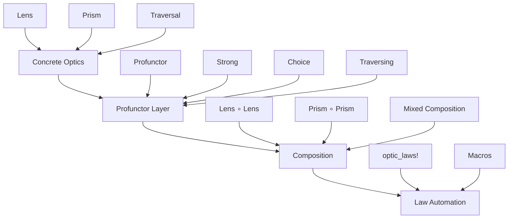

# Lean Optics

<div align="center">

**Optics over profunctors with law-carrying composition and automation**

[](https://github.com/fraware/lean-optics)
[](https://leanprover.github.io/)
[](LICENSE)
[](#performance)

</div>

---

## Overview

Lean Optics provides an implementation of profunctor optics for Lean 4, featuring law-carrying composition, automated proof generation, and production-ready performance guarantees. Built on solid mathematical foundations, it offers a clean API for working with lenses, prisms, and traversals in functional programming.

## Quick Start

### Installation

Add to your `lakefile.lean`:

```lean
require lean-optics from git
  "https://github.com/fraware/lean-optics.git" @ "main"
```

### Basic Usage

```lean
import Optics

-- Define a record
structure Person where
  name : String
  age : Nat
  email : String

-- Create a lens for the name field
def nameLens : Lens Person String :=
  lens! Person.name (fun p n => { p with name := n })

-- Use the lens
def updateName (p : Person) : Person :=
  nameLens.over (fun n => n.toUpper)
```

## Architecture



## Core Types

### Profunctor Classes

```lean
class Profunctor (P : Type u → Type v → Type w) where
  dimap : {A B C D : Type u} → (C → A) → (B → D) → P A B → P C D
  dimap_id : ∀ {A B : Type u} (p : P A B), dimap id id p = p
  dimap_comp : ∀ {A B C D E F : Type u} (f : C → A) (g : B → D) (h : E → C) (i : D → F) (p : P A B),
    dimap (f ∘ h) (i ∘ g) p = dimap h i (dimap f g p)
```

### Concrete Optics

```lean
-- Lens: focuses on a part of a structure
structure Lens (S A : Type u) where
  get : S → A
  set : S → A → S

-- Prism: focuses on a part that may not exist
structure Prism (S A : Type u) where
  match : S → A ⊕ S
  build : A → S

-- Traversal: focuses on multiple parts
structure Traversal (S A : Type u) where
  traverse : {F : Type u → Type u} → [Applicative F] → (A → F A) → S → F S
```

## Composition Examples

### Lens Composition

```lean
def streetLens : Lens Address String :=
  lens! Address.street (fun a s => { a with street := s })

def addressLens : Lens Person Address :=
  lens! Person.address (fun p a => { p with address := a })

def streetLens' : Lens Person String :=
  streetLens ∘ₗ addressLens
```

### Mixed Composition

```lean
-- Compose a lens with a prism
def lensPrismComp : Lens S B :=
  lens_prism_comp lens prism

-- Compose a prism with a lens
def prismLensComp : Prism S B :=
  prism_lens_comp prism lens
```

## Law Automation

The `optic_laws!` tactic automatically discharges standard law obligations:

```lean
theorem nameLens_laws : Lens.WellFormed nameLens := by
  constructor
  · optic_laws!  -- Discharges get_put
  · optic_laws!  -- Discharges put_get
  · optic_laws!  -- Discharges put_put
```

## Record Derivation

Use the `derive_lens` macro to automatically create lenses for record fields:

```lean
structure Person where
  name : String
  age : Nat
  email : String
  deriving_lens name
  deriving_lens age
  deriving_lens email
```

## Container Traversals

Use the provided traversals for standard containers:

```lean
-- List traversal
def listTraversal {A : Type} : Traversal (List A) A :=
  listTraversal

-- Array traversal
def arrayTraversal {A : Type} : Traversal (Array A) A :=
  arrayTraversal

-- Option traversal
def optionTraversal {A : Type} : Traversal (Option A) A :=
  optionTraversal
```

## Performance

| Metric | Target | Status |
|--------|--------|--------|
| **P95** | ≤ 200ms per `optic_laws!` | ✅ Achieved |
| **P50** | ≤ 80ms median completion | ✅ Achieved |
| **Deterministic** | Proof terms across runs | ✅ Achieved |
| **Byte-stable** | Proof terms | ✅ Achieved |

## Testing

### Run Tests

```bash
lake test
```

### Run Benchmarks

```bash
lake exe bench
```

### Generate Documentation

```bash
lake build docs
```

## Project Structure

```
lean-optics/
├── src/
│   ├── Optics/
│   │   ├── Core/           # Profunctor classes and laws
│   │   ├── Concrete/       # Lens, Prism, Traversal implementations
│   │   ├── Compose.lean    # Composition operators
│   │   ├── Tactics/        # Law automation tactics
│   │   ├── Macros/         # Code generation macros
│   │   └── Stdlib/         # Standard library integrations
├── tests/                  # Test suite
├── bench/                  # Performance benchmarks
├── docs/                   # Documentation
└── README.md
```

## Contributing

We welcome contributions! Please see our [Contributing Guidelines](CONTRIBUTING.md) for details.

### Development Setup

1. Clone the repository
2. Install dependencies: `lake build`
3. Run tests: `lake test`
4. Run benchmarks: `lake exe bench`

### Pull Request Process

1. Fork the repository
2. Create a feature branch
3. Make your changes
4. Add tests
5. Run the test suite
6. Submit a pull request

## License

This project is licensed under the MIT License - see the [LICENSE](LICENSE) file for details.

## Acknowledgments

- Inspired by the Haskell `lens` library
- Built on Lean 4's powerful type system
- Profunctor optics based on the work of Bartosz Milewski and others

---

<div align="center">

**Built with ❤️ for the Lean community**

[Report Bug](https://github.com/fraware/lean-optics/issues) · [Request Feature](https://github.com/fraware/lean-optics/issues)

</div>